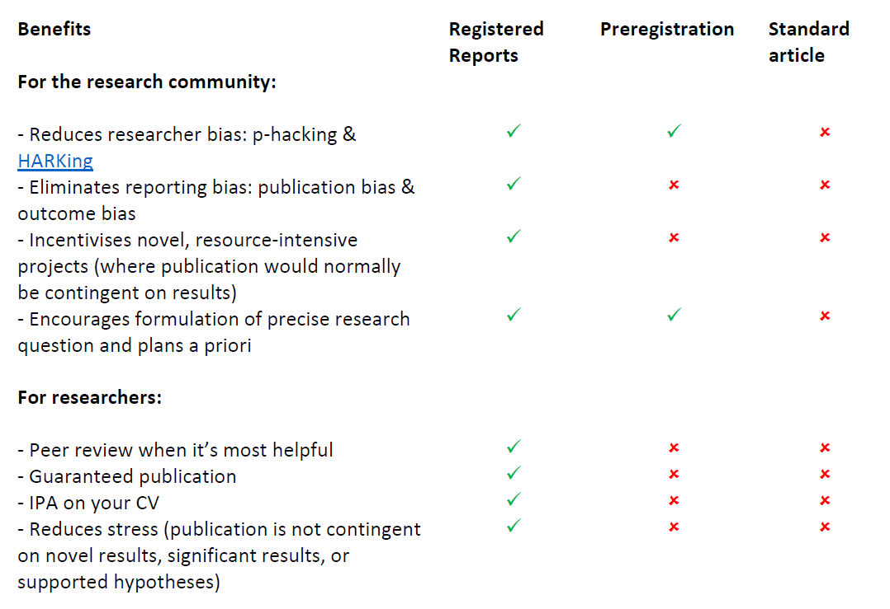
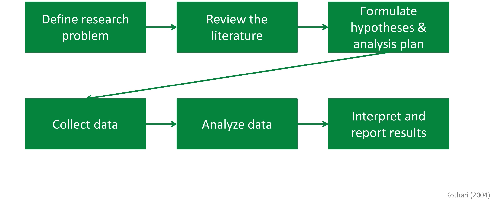
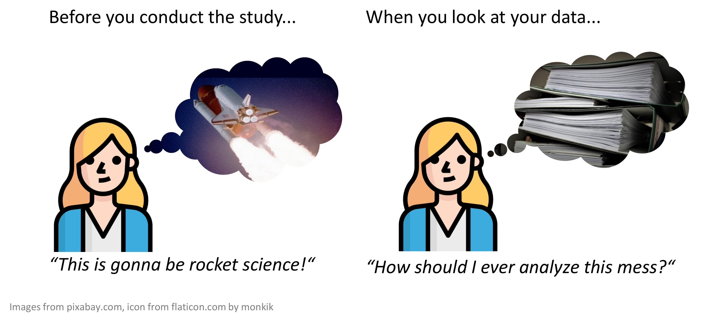
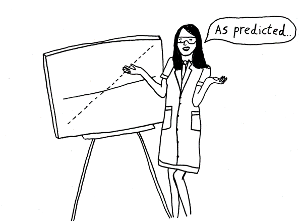
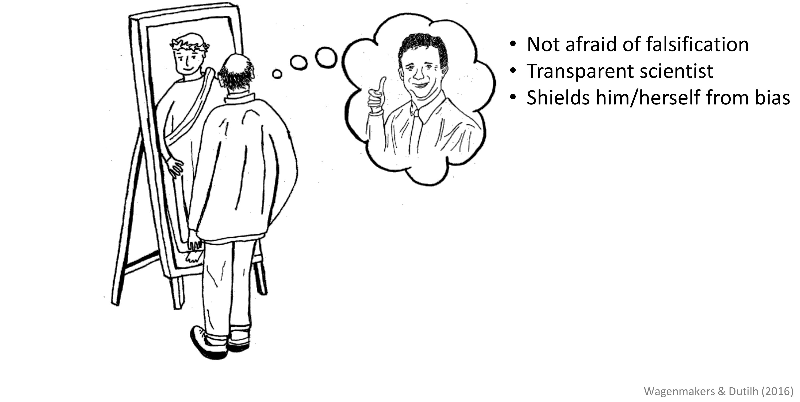
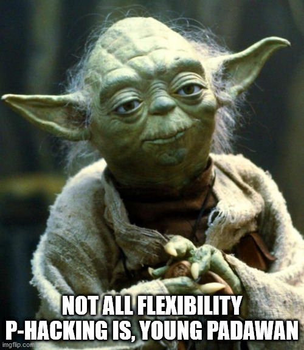
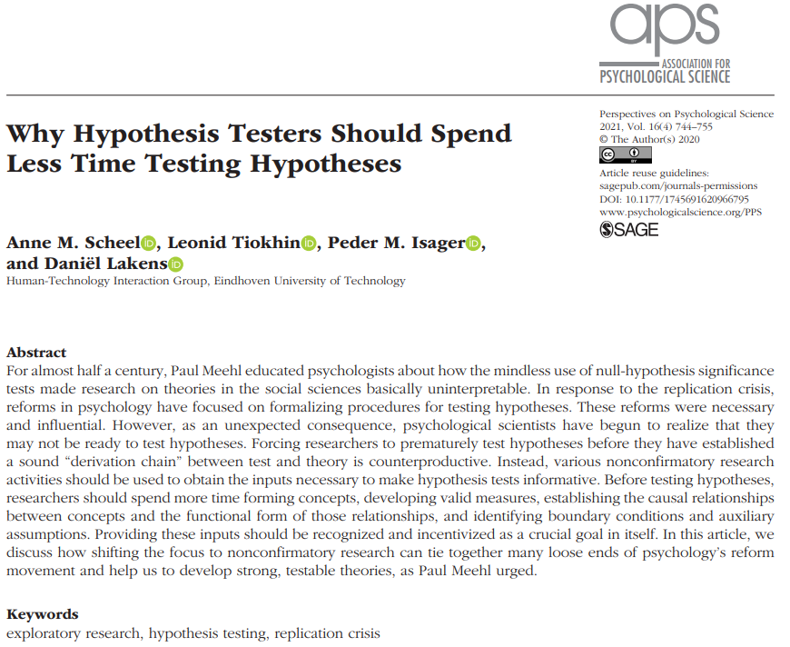
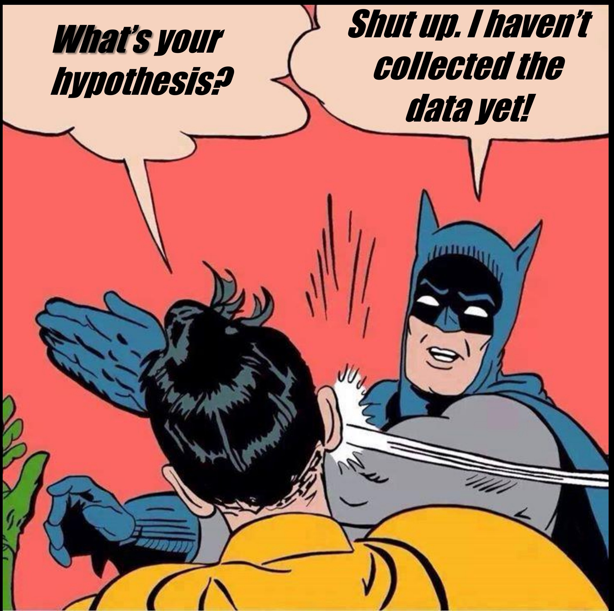
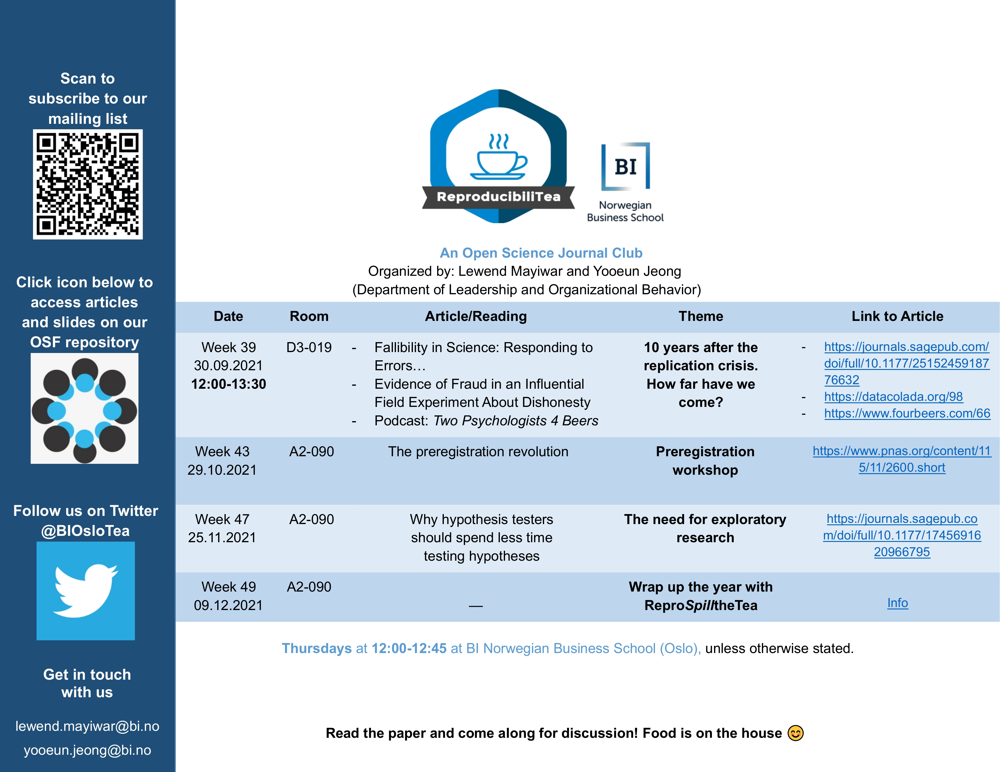
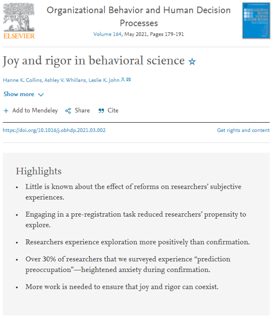

---
output:
  xaringan::moon_reader
---

```{r setup, include=FALSE}
knitr::opts_chunk$set(echo = TRUE,warning = FALSE, message = FALSE, 
                      fig.width = 10.5, fig.height = 4, 
                      comment = NA, rows.print = 16)
```

```{r metathis, echo=FALSE}
library(metathis)
meta() %>%
  meta_name("github-repo" = "lewendm/slides") %>%
  meta_social(
    title = "Build your own universe",
    description = paste(
      "Scale high-quality research data provisioning with R packages.",
      "Presented at R/Medicine 2020."
    ),
    url = "https://build-your-own-universe.netlify.app",
    image = "https://build-your-own-universe.netlify.app/social-card.png",
    image_alt = paste(
      "Title slide of Build your own universe:",
      "Scale high-quality research data provisioning with R packages,",
      "presented at R/Medicine 2020 by Travis Gerke and Garrick Aden-Buie"
    ),
    og_type = "website",
    og_author = "Travis Gerke",
    twitter_card_type = "summary_large_image",
    twitter_creator = "@LewendM",
    twitter_site = "@LewendM"
  )
```

class: inverse, center, middle
background-image: url(background1.jpg)
background-size: cover
# Preregistration

### WHAT, WHY, WHEN, HOW?
.large[Lewend Mayiwar | LOB Friday Seminar | 4 Feb 2022]

---
background-image:url(https://media.giphy.com/media/xUA7aLpVxPVEoEPXji/giphy-downsized-large.gif)
background-size: cover
---
class: center, middle 
# What is a preregistration? `r emo::ji("deadpan")` 
A time-stamped record that outlines hypotheses, method, and analytical plan,
**before** data collection.
---
class: center, middle
# Preregistration ≠ Registered Report
A journal article that involves peer-review before
data collection. Acceptance/rejection not based on results.

https://www.cos.io/initiatives/registered-reports
---
class: center, middle 
# Benefits of preregistration vs. registered report
(Source https://doi.org/10.31222/osf.io/x7aqr)

---
class: center, middle 
# Why preregister? `r emo::ji("person_shrugging_medium_skin_tone")`
## `r emo::ji("keycap_1")`Clear distinction between "confirmatory" and exploratory research.

Source:https://osf.io/zjrhu/
---
class: center, middle 
# Why preregister?
## `r emo::ji("keycap_1")`Clear distinction between "confirmatory" and exploratory research.

Source:https://osf.io/zjrhu/
---
class: center, middle
# Why preregister?
## `r emo::ji("keycap_2")`Get your head around your research.

Source:https://osf.io/zjrhu/
---
class: center, middle
# Why preregister?
## `r emo::ji("keycap_3")`Take credit for your ideas.
.center[]
Source:https://osf.io/zjrhu/
---
class: center, middle
# Why preregister?
## `r emo::ji("keycap_4")`Build your reputation.

Source:https://osf.io/zjrhu/
---
class: center, middle
# Why preregister?
## `r emo::ji("keycap_5")`Comply with new regulations and standards.

---
# A preregistration **does not**...
--

###Stifle creativity.
--

###Does not automatically make a study better than a non-preregistered study.
--

###Solve p-hacking.
--

###Solve the file-drawer problem.
---
class: center, middle 
# What preregistration **actually** does `r emo::ji("wow")`
--

###Allows others to transparently determine the severity of a test.
--

###Distinguishes between hypothesis-testing and exploratory research.
--

###**Saves** time and helps your future self.
--

###Helps you to identify problems early on.
---
class: center, top

###Deviations are often necessary
.center[]
.footnote[http://daniellakens.blogspot.com/2021/10/not-all-flexibility-p-hacking-is-young.html]
---
class: center, middle
###Sometimes, you're not ready for hypothesis-testing
.pull-left[]

.pull-right[]
---
class: center, middle 
# Preregistration on the Open Science Framework
{width=30%}
---
### Possible to update preregistration (new feature)
.pull-left[<blockquote class="twitter-tweet"><p lang="en" dir="ltr">Even the best laid plans sometimes don&#39;t go as expected in reality. In a major OSF update released today, you can now transparently report changes in your preregistrations to help others understand what changed and why.<br><br>The interface makes it easy for readers to see what changed <a href="https://t.co/lFD2luZWOF">pic.twitter.com/lFD2luZWOF</a></p>&mdash; Brian Nosek (@BrianNosek) <a href="https://twitter.com/BrianNosek/status/1466814366469218317?ref_src=twsrc%5Etfw">December 3, 2021</a></blockquote> <script async src="https://platform.twitter.com/widgets.js" charset="utf-8"></script>
]
--
.pull-right[]
---
class: center
## Interested in open science? Join our **ReproducibiliTea** meetings/workshops!


---

class: center, middle
# Tips `r emo::ji("bulb")`
--

Don't have clear hypotheses? Consider exploratory study to derive hypotheses.

--

Try to estimate your effect size (e.g., meta-analysis).

--

Run power analysis to calculate required N to detect effect size.

--

Ask colleagues to review your preregistration.

--

Find a preregistration that fits your planned study, use as template.

--

The more detailed the prereg, the better. But start with small steps.

--

Increase power by preregistering one-tailed tests (http://daniellakens.blogspot.com/2016/03/one-sided-tests-efficient-and-underused.html).

---

class: center, middle
###Preregistration anxiety is real, in the beginning. But don't let that kill your research joy! 

###Exploration and deviation should be expected. Preregistration simply makes this clear.



---

class: top, left

# Tools `r emo::ji("chest")`
--

"The preregistration revolution" Nosek et al. (2018; https://doi.org/10.1073/pnas.1708274114)

--

Preregistration template for **qualitative** research: https://osf.io/6z2hr

--

Preregistration template for **systematic reviews**: https://osf.io/by27q/

--

Preregistration template for **secondary data**: https://psyarxiv.com/hvfmr/

--

Free power analysis software (although limited functionality):https://www.psychologie.hhu.de/arbeitsgruppen/allgemeine-psychologie-und-arbeitspsychologie/gpower

--

*pwr* (power analysis) package in R:https://cran.r-project.org/web/packages/pwr/pwr.pdf

--

Power analysis for **mediation analysis**:http://marlab.org/power_mediation/

--

**Sample size justification** app:https://shiny.ieis.tue.nl/sample_size_justification/

--

More tools here: https://wiki.mgto.org/doku.php/r_shiny_apps (Gilad Feldman)

---
class: center, middle
# Let's preregister a study `r emo::ji("bookmark_tabs")`
